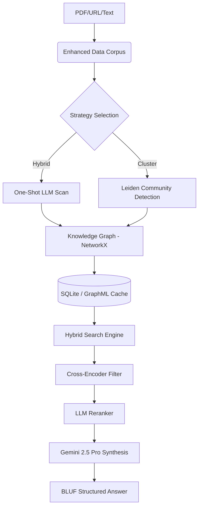

# 🌌 Nsure AI: The Architecture of Infinite Intelligence

> **"In a world drowning in data, Nsure AI provides the lighthouse of structured knowledge."**

Nsure AI is a prestigious, high-fidelity **GraphRAG (Graph-based Retrieval-Augmented Generation)** ecosystem designed for the most demanding domains: **Legal, Insurance, and Finance**. It doesn't just search; it reconstructs the logical skeleton of your documents to provide "Perfect" answers grounded in verifiable evidence.

[](https://python.org)
[](https://reactjs.org)
[](https://aistudio.google.com)
[](https://arxiv.org/abs/2404.16130)

---

## 🏛 The Philosophy: Why Nsure AI?

Standard RAG systems treat documents as a pile of text chunks. They are fast, but they are "blind" to the **connections** between rules, exclusions, and definitions. Nsure AI was built to solve specific high-stakes problems:

### 1. The "Carve-Back" Problem (Why GraphRAG?)
In insurance, a "General Exclusion" might be overruled by a "Carve-Back" provision 300 pages later. Vector search often misses this because the chunks are semantically different. Nsure AI builds a **Knowledge Graph** where these provisions are explicitly linked, ensuring the "Pro" model sees the override.

### 2. The "God Level" Synthesis (Why These Rules?)
Simple AI answers are often too conversational or vague for professional use. We implemented a **multi-layered Synthesis Engine** with strict rules:
*   **BLUF (Bottom Line Up Front)**: Critical for fast decision-making.
*   **Burden of Proof Tracking**: Explicitly identifies *who* must prove *what* (e.g., Insurer vs. Insured).
*   **Hierarchy of Evidence**: Prioritizes specific policy sections over general descriptions.

---

## 🛠 Technical Anatomy: The "Under the Hood" Details

### 🔄 The Hybrid Extraction Strategy
Unlike naive sliding windows that break context, Nsure AI uses a **two-phase extraction**:
1.  **Semantic Seed Scanning**: The LLM performs a high-fidelity scan to identify "Anchor Entities" (Articles, Definitions, Parties).
2.  **Relational Weaving**: A deterministic engine expands these seeds into a "Rich Mention Map" using **SpaCy NER** and graph-based co-occurrence discovery.
3.  **Batching**: Relations are extracted in batches (configurable via `KG_RELATION_BATCH_SIZE`) to maximize throughput while respecting Gemini's Rate Limits.

### 🔍 Hybrid Retrieval & Citation Boosting
Our retrieval doesn't just look for "similar" text; it looks for **Logical Relevance**:
*   **Vector + Graph**: We combine Cosine Similarity with **Graph Walk Expansion**. If a retrieved chunk mentions "Article 32", the system automatically pulls in the definition of "Article 32" even if it wasn't semantically similar to the query.
*   **Citation Regex Engine**: A specialized lexical booster detects legal citations (e.g., `Article 13(2)(b)`) and force-injects them into the candidate pool, overcoming OCR formatting noise.
*   **Community Expansion**: Uses the **Leiden Algorithm** to group entities into "thematic islands," allowing the AI to answer global questions like "Summarize all exclusions in this policy."

### ⚖️ Dual-Stage Reranking: Precision vs. Noise
Retrieval is often a trade-off between **Recall** (finding everything) and **Precision** (finding only the truth). Nsure AI solves this with a sophisticated **Dual-Stage Reranking Pipeline**:

1.  **Stage 1: The Local Filter (Cross-Encoder)**:
    *   **Mechanism**: Uses a local `ms-marco-MiniLM-L-6-v2` Cross-Encoder.
    *   **Purpose**: Rapidly scores 100+ candidates against the query on a byte-to-byte level. This stage acts as a "coarse filter" that removes obviously irrelevant noise without consuming API credits.
    *   **Result**: Trims the candidate pool down to the most semantically promising top 40-60 items.

2.  **Stage 2: The Reasoning Filter (LLM Reranker)**:
    *   **Mechanism**: **Gemini 2.5 Pro** evaluates the remaining items.
    *   **Purpose**: Unlike the Cross-Encoder, the LLM understands **contextual logic**. It applies a specialized "Legal & Insurance Rubric" to ensure that definitions, exclusions, and hierarchy rules are prioritized. It can distinguish between a sentence that *looks* relevant (keyword match) and one that *is* legally controlling.
    *   **Result**: A distilled set of 12-15 "Gold Standard" evidence points passed to the final Synthesis engine.

3.  **The "Safety Net" Fallback**:
    If the LLM stage fails due to rate limits or connectivity, the system automatically falls back to the Stage 1 scores, ensuring the user always gets an answer, even if slightly less "refined."

---

## 🧠 Minute Details & Optimizations

| Component | Minute Detail | Rationale |
| :--- | :--- | :--- |
| **Caching** | `SQLite3` + `DiskJSON` | Every embedding and LLM call is cached. This reduces cost by 90% for repeated queries and enables sub-second responses. |
| **Memory** | `ScopedEnv` Manager | Dynamically overrides environment variables per-request, allowing a single backend to handle different model tiers/settings without crashing. |
| **Resilience** | Recursive JSON Repair | Detects "Prose Leaks" or truncation in LLM responses and forces a syntax-aware repair block to ensure valid API output. |
| **Efficiency** | Gemini API Embeddings | By offloading embeddings to the Google Cloud, we reduced backend RAM usage by **450MB**, enabling deployment on standard 1GB Cloud Run instances. |

---

## 🚧 Challenges Faced & Key Learnings

### 1. The 429 Rate-Limit Battle
**Problem**: Building a Knowledge Graph for a 100-page PDF can trigger thousands of API calls.
**Solution**: We implemented **Purpose-Specific Model Routing**. "Flash" models handle the heavy entity extraction, while "Pro" is reserved for high-stakes synthesis and re-ranking.

### 2. The "Context-Cutoff" Puzzle
**Problem**: Large Graphs often exceeded the 8k output limit of standard LLMs.
**Solution**: We shifted the ontology to **Prioritize Relations over Entities**. By focusing on the "verbs" (how things interact), we maintain logic even when the "nouns" are numerous.

### 3. The OCR Jaggies
**Problem**: PDF text often has broken lines and weird characters that confuse LLMs.
**Solution**: Implemented a **Normalization Pipeline** that cleans text before embedding but preserves "Citation Anchors" for the regex engine.

---

## 💻 The Infinite Stack: Professional Grade Tooling

Nsure AI is built on a "Hardened" stack designed for low latency, high scalability, and memory efficiency.

### 🔌 Backend (The Reasoning Core)
*   **Language**: **Python 3.10+** (Asynchronous processing where possible)
*   **Framework**: **Flask** (High-throughput API wrapper)
*   **Graph Engine**: **NetworkX** (Industrial-grade graph modeling and traversal)
*   **Natural Language**: **SpaCy** (Deterministic NER & Sentence Splitting)
*   **Persistence**: **GraphML** (Interoperable graph format) & **SQLite3** (High-speed local caching)
*   **Analytics**: **NumPy** & **Scikit-learn** (Vector math and clustering efficiency)

### 🧠 AI Ecosystem (The Intelligence)
*   **Primary LLM**: **Google Gemini 2.5 Pro** (1M+ context window capability)
*   **Secondary/Speed Tier**: **Gemini 2.5 Flash** (Used for high-volume extraction)
*   **Embeddings**: **Google GenAI Embeddings** (API-based, zero local RAM footprint)
*   **Reranking**: **Cross-Encoder V3** (`ms-marco-MiniLM-L-6-v2`) for local precision
*   **Architecture**: **GraphRAG** (Retrieved via Hybrid Search + Graph Walk)

### 🎨 Frontend (The Command Center)
*   **Library**: **React 18** + **TypeScript** (Strict typing for mission-critical UI)
*   **Build Tool**: **Vite** (Next-gen bundling speed)
*   **Styling**: **Tailwind CSS** (Utility-first, high-fidelity design)
*   **Animations**: **Framer Motion** (Smooth transitions and micro-interactions)
*   **State Management**: **TanStack Query (React Query)** (Optimistic updates & caching)
*   **Icons/UI**: **Lucide React** & **Custom Glassmorphism components**

### 📦 Infrastructure (The Deployment)
*   **Containerization**: **Docker** (Multi-stage build optimized for < 1GB RAM)
*   **Cloud Hosting**: Optimized for **Google Cloud Run** or **Render**
*   **CD/CI Ready**: Stateless design with `.env` based configuration

---

## 🚀 Deployment Protocol

### 1. Environment Requirements
- **Python**: 3.10+ (Core Logic)
- **Node.js**: 18+ (Vite/React Frontend)
- **API Key**: [Google Gemini API Key](https://aistudio.google.com/app/apikey)

### 2. Quick Start
```bash
# Clone the Core
git clone https://github.com/IND-Anshuman/Nsure_graph_AI.git
cd Nsure_graph_AI

# Backend Ignition
python -m venv .venv
source .venv/bin/activate # Windows: .venv\Scripts\activate
pip install -r requirements.txt
cp .env.example .env # Insert your API keys
python main.py

# Frontend Command Center
cd frontend
npm install
npm run dev
```

### 📉 Recommended Config for Production
```env
GEMINI_MODEL=gemini-2.5-pro
KG_EMBEDDING_PROVIDER=gemini
KG_DOC_WORKERS=2
KG_RELATION_BATCH_SIZE=10
```

---

## 📂 Architecture Overview


---

## 🎓 The Learning Element
Building **Nsure AI** taught us that **Prompt Engineering is only 20% of the battle**. The real intelligence lives in the **Data Structure**. A well-built Graph compensates for LLM weaknesses, turning a stochastic parrot into a logical analyst. We learned to treat LLMs not as "databases," but as "reasoning engines" over structured memories.

---
<p align="center">
  <b>Nsure AI: Intelligence Beyond Parameters.</b><br>
  <i>Built for the next era of Knowledge Engineering.</i>
</p>
