# 🌌 Nsure AI: The Architecture of Infinite Intelligence

> **Standard RAG is a flashlight. Nsure GraphRAG is a lighthouse.**

Nsure AI is a prestigious, high-fidelity **GraphRAG (Graph-based Retrieval-Augmented Generation)** ecosystem. It doesn't just "search" your documents; it **understands** the complex web of relationships, provisions, and dependencies within them. 

[](https://python.org)
[](https://reactjs.org)
[](https://aistudio.google.com)
[](https://arxiv.org/abs/2404.16130)

---

## 🐣 Newbie's Corner: What is this?

Imagine you have a 500-page policy book. 
*   **Standard AI (RAG)** looks for keywords, finds a relevant page, and tries to summarize it. It often misses how a rule on page 10 interacts with an exception on page 412.
*   **Nsure AI (GraphRAG)** reads the whole book first. It identifies "Entities" (like *Policy Holder*, *Claim*, *Exclusion*) and "Relations" (like *Claim [IS SUBJECT TO] Exclusion*). 
*   It builds a **Knowledge Graph**—a giant map of how everything connects. When you ask a question, it navigates this map to find the truth, even if it's buried across multiple sections.

### ⚖️ The Superiority Gap

| Feature | Standard RAG | Nsure GraphRAG |
| :--- | :--- | :--- |
| **Logic** | Simple keyword/vector match | Structural relationship mapping |
| **Context** | Local (few chunks) | Global (entire graph communities) |
| **Hallucination** | High (lacks grounding) | Near Zero (grounded in graph edges) |
| **Complex Queries** | Struggles with 3-step logic | Excels at "What-if" scenarios |

---

## 🛠 Operational Workflow

Nsure AI operates through a high-precision 6-stage pipeline, visualized in real-time on your dashboard:

```mermaid
graph TD
    A[📄 Ingestion] -->|Parsing PDFs/URLs| B[🔍 Extraction]
    B -->|Identifying Entities & Roles| C[🌐 Leiden Clustering]
    C -->|Thematic Community Sorting| D[📝 Summarization]
    D -->|Synthesizing Knowledge Blocks| E[🖇 Hybrid Retrieval]
    E -->|Vector + Graph Search| F[✨ Intelligence Synthesis]
    F -->|Final Grounded Report| G[🎯 Precision Answer]
```



---

## 🚀 Quick-Start Pro Protocol

Follow these steps to deploy the most advanced policy intelligence unit locally.

### 1. The Foundation (Prerequisites)
- **Environment**: Python 3.10+ & Node.js 18+
- **Key**: A [Google Gemini API Key](https://aistudio.google.com/app/apikey)

### 2. Ignite the Backend
```bash
# Clone the repository
git clone https://github.com/IND-Anshuman/Nsure_graph_AI.git
cd Nsure_graph_AI

# Create virtual environment
python -m venv .venv
source .venv/bin/activate  # On Windows: .venv\Scripts\activate

# Install Core Engine dependencies
pip install -r requirements.txt

# Configure Intelligence
cp .env.example .env
# [STOP] Edit .env and add your GOOGLE_API_KEY
```

### 3. Launch the Terminal
```bash
python main.py
```

### 4. Deploy the Console
```bash
cd frontend
npm install
npm run dev
```
Open `http://localhost:5173` to enter the Intelligence Console.

---

## 📜 The Intelligence Rulebook

For peak performance and "God Level" accuracy, use these recommended parameters in the **Advanced Settings**:

| Parameter | Recommended Range | Why? |
| :--- | :--- | :--- |
| **Window Size** | `14,000 - 18,000` | Optimal balance between speed and relationship density. |
| **Parallel Workers** | `4` | Maximum stability for free-tier Gemini API limits. |
| **Top-N Semantic** | `60 - 100` | Ensures a wide enough net to catch relevant context. |
| **Rerank-K Pool** | `20 - 40` | Focused precision before final synthesis. |
| **Top-K Final** | `30 - 60` | Provides the LLM with enough evidence to be authoritative. |

> [!TIP]
> Use **High Speed (MiniLM)** embeddings if you are running on a CPU. Switch to **Max Context (MPNet)** only if you have a capable GPU for faster processing.

---

## 🧠 Core Features

- **Autonomous Graph Construction**: Automatic extraction of entities and regulatory dependencies.
- **Hierarchical Summarization**: Powered by the **Leiden Algorithm** to find thematic clusters (e.g., all medical exclusions) automatically.
- **Scenario Testing**: Ideal for "What-If" Analysis in insurance, legal, and compliance documents.
- **Audit-Ready Evidence**: Every answer provides a **Hierarchy of Evidence** with clickable citations back to the source text.
- **Stateless Intelligence**: Every research session is independent, ensuring data privacy and zero cross-leakage.

---

## 📂 Project Anatomy

- `/graph_maker`: The "Brain". Handles NER, Leiden clustering, and graph serialization.
- `/answer_synthesis`: The "Voice". Multi-stage retrieval and grounded report generation.
- `/frontend`: The "Interface". Premium glassmorphic UI for high-stakes analysis.
- `main.py`: The "Heart". FastAPI-driven coordination of the entire pipeline.

---

## ⚖️ License & Disclaimer

**Version**: 1.0.4  
**Philosophy**: Intelligence Beyond Parameters.

*Nsure AI is designed for institutional-grade accuracy. It is a tool for analysts, not a replacement for legal counsel. Use responsibly.*

---
<p align="center">
  <b>Built for the next era of Knowledge Engineering.</b>
</p>
